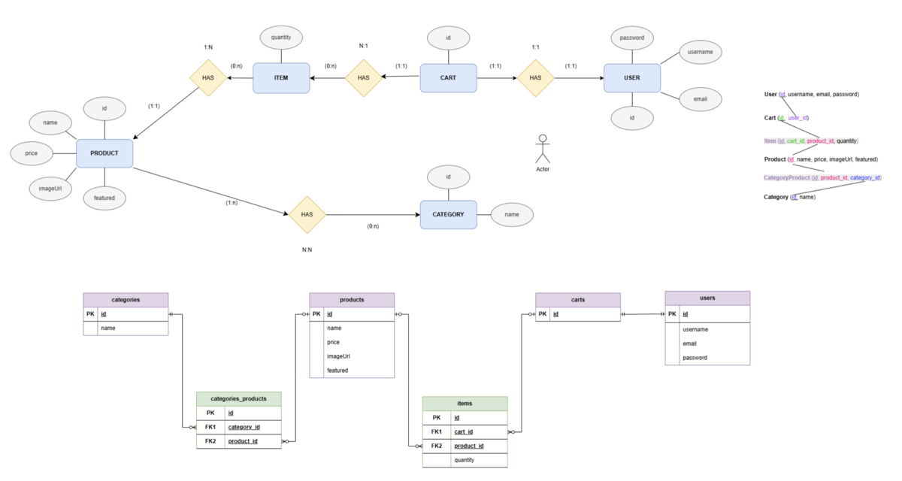
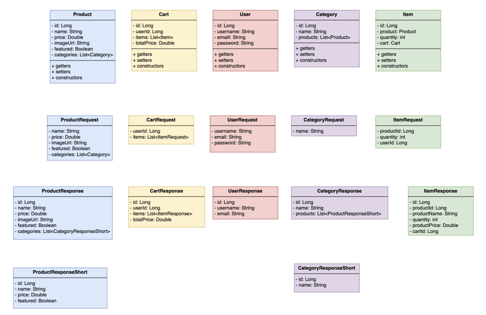

# 👓 Iris & Co. - Ecommerce Optic API

A robust backend REST API for an e-commerce platform specializing in optical products. Built with modern Java technologies including Spring Boot, Maven, and following RESTful best practices.


---

## 📋 Table of Contents

- [✨ Features](#-features)
- [🚀 Getting Started](#-getting-started)
- [⚙️ Installation](#️-installation)
- [🏃‍♂️ Running the Application](#️-running-the-application)
- [📚 API Documentation](#-api-documentation)
- [🌐 API Endpoints](#-api-endpoints)
- [🔧 Technologies](#-technologies)
- [📊 Architecture](#-architecture)
- [🧪 Tests](#-tests)
- [🤝 Contributing](#-contributing)
- [📄 Team Members](#-team-members)

---

## ✨ Features

- 👥 **User Management**: Complete user registration, authentication, and profile management
- 📦 **Product Catalog**: Full CRUD operations for products and categories
- 🛒 **Shopping Cart**: Advanced cart management with item tracking
- 🏷️ **Category System**: Organized product categorization
- 🔍 **Search & Filter**: Product search and filtering capabilities
- ⚡ **Performance**: Optimized queries and caching
- 🛡️ **Security**: Input validation and secure endpoints
- 🚨 **Error Handling**: Comprehensive exception handling with custom error responses
- 📖 **API Documentation**: Interactive API documentation with Postman collection

---

## 🚀 Getting Started

### Prerequisites

Before you begin, ensure you have the following installed:

- **Java 11+** - [Download here](https://www.oracle.com/java/technologies/downloads/)
- **Maven 3.6+** - [Download here](https://maven.apache.org/download.cgi)
- **Database** - MySQL, PostgreSQL, or H2 (for development)
- **Git** - [Download here](https://git-scm.com/)

### Quick Start

```bash
# Clone the repository
git clone https://github.com/your-username/ecommerce-optic.git
cd ecommerce-optic

# Build the project
./mvnw clean install

# Run the application
./mvnw spring-boot:run
```

The API will be available at `http://localhost:8080`

---

## ⚙️ Installation

### 1. Clone the Repository
```bash
git clone https://github.com/your-username/ecommerce-optic.git
cd ecommerce-optic
```

### 2. Configure Database
Edit `src/main/resources/application.yaml` with your database credentials:

```yaml
spring:
  datasource:
    url: jdbc:mysql://localhost:3306/ecommerce_optic
    username: your_username
    password: your_password
    driver-class-name: com.mysql.cj.jdbc.Driver
  
  jpa:
    hibernate:
      ddl-auto: update
    show-sql: true
    properties:
      hibernate:
        dialect: org.hibernate.dialect.MySQL8Dialect
        format_sql: true

server:
  port: 8080

logging:
  level:
    com.yourpackage: DEBUG
```

### 3. Build the Project
```bash
./mvnw clean install
```

---

## 🏃‍♂️ Running the Application

### Development Mode
```bash
./mvnw spring-boot:run
```

---

## 📚 API Documentation

### Flowchart


### Postman Collection
Access our comprehensive API collection:
[🔗 **Join Postman Team**](https://app.getpostman.com/join-team?invite_code=4798026b0adda5d6fdc40d822ca65f16f5320d13dc339788d34090b78c893bc5&target_code=2ab1c896448c173edf9c6616f91c416f)

### Base URL
```
http://localhost:8080/api
```

### Authentication
Currently, the API doesn't require authentication, but it's recommended to implement JWT tokens for production use.

---

## 🌐 API Endpoints

### 👥 Users Management

| Method | Endpoint           | Description         | Request Body                                                                                       |
|--------|-------------------|---------------------|----------------------------------------------------------------------------------------------------|
| `GET`    | `/api/users`       | List all users      | -                                                                                                  |
| `GET`    | `/api/users/{id}`  | Get user by ID      | -                                                                                                  |
| `POST`   | `/api/users`       | Register new user   | `{ "username": "yourUsername", "email": "your_email@mail.com", "password": "your_password12345" }` |
| `PUT`    | `/api/users/{id}`  | Update user         | `{ "username": "NewName", "email": "new@mail.com" }`                                               |
| `DELETE` | `/api/users/{id}`  | Delete user         | -                                                                                                  |

### 📦 Products Management

| Method | Endpoint                | Description         | Request Body                                      |
|--------|-------------------------|---------------------|--------------------------------------------------|
| `GET`    | `/api/products`         | List all products   | -                                                |
| `GET`    | `/api/products/{id}`    | Get product by ID   | -                                                |
| `POST`   | `/api/products`         | Add new product     | `{ "name": "Glasses", "price": 99.99, "categoryId": 1 }` |
| `PUT`    | `/api/products/{id}`    | Update product      | `{ "name": "New Glasses", "price": 89.99 }`      |
| `DELETE` | `/api/products/{id}`    | Delete product      | -                                                |

### 🏷️ Categories Management

| Method | Endpoint                   | Description         | Request Body                                      |
|--------|----------------------------|---------------------|--------------------------------------------------|
| `GET`    | `/api/categories`          | List all categories | -                                                |
| `GET`    | `/api/categories/{id}`     | Get category by ID  | -                                                |
| `POST`   | `/api/categories`          | Add new category    | `{ "name": "Sunglasses" }`                       |
| `PUT`    | `/api/categories/{id}`     | Update category     | `{ "name": "Optical" }`                          |
| `DELETE` | `/api/categories/{id}`     | Delete category     | -                                                |

### 🛒 Shopping Cart Management

| Method | Endpoint                | Description         | Request Body                                      |
|--------|-------------------------|---------------------|--------------------------------------------------|
| `GET`    | `/api/carts`            | List all carts      | -                                                |
| `GET`    | `/api/carts/{id}`       | Get cart by ID      | -                                                |
| `POST`   | `/api/carts`            | Create new cart     | `{ "userId": 1 }`                                |
| `PUT`    | `/api/carts/{id}`       | Update cart         | `{ "status": "COMPLETED" }`                      |
| `DELETE` | `/api/carts/{id}`       | Delete cart         | -                                                |

### 📝 Cart Items Management

| Method | Endpoint                              | Description         | Request Body                                      |
|--------|---------------------------------------|---------------------|--------------------------------------------------|
| `POST`   | `/api/carts/{cartId}/items`           | Add item to cart    | `{ "productId": 1, "quantity": 2 }`              |
| `PUT`    | `/api/carts/{cartId}/items/{itemId}`  | Update cart item    | `{ "quantity": 3 }`                              |
| `DELETE` | `/api/carts/{cartId}/items/{itemId}`  | Remove cart item    | -                                                |

---

## 🔧 Technologies

### Backend Stack
- **Java 11+** - Core programming language
- **Spring Boot 2.7+** - Application framework
- **Spring Data JPA** - Data persistence layer
- **Spring Web** - RESTful web services
- **Maven** - Dependency management and build tool
- **Hibernate** - ORM framework
- **MySQL/PostgreSQL** - Database systems
- **H2 Database** - In-memory database for testing
- **Jackson** - JSON processing
- **Lombok** - Boilerplate code reduction

### Development Tools
- **Spring Boot DevTools** - Development utilities
- **JUnit 5** - Testing framework
- **Mockito** - Mocking framework
- **Postman** - API testing and documentation

---

## 📊 Architecture

### Project Structure
```
ecommerce-optic/
├── docs/
│   └── images/
├── src/
│   ├── main/
│   │   ├── java/
│   │   │   └── com/
│   │   │       └── irisandco/
│   │   │           └── ecommerce_optic/
│   │   │               ├── cart/
│   │   │               ├── category/
│   │   │               ├── exception/
│   │   │               ├── item/
│   │   │               ├── product/
│   │   │               ├── user/
│   │   │               └── EcommerceOpticApplication.java
│   │   └── resources/
│   │       └── application.yaml
│   └── test/
│       └── java/
│           └── com/
│               └── irisandco/
│                   └── ecommerce_optic/
│                       ├── cart/
│                       ├── category/
│                       ├── item/
│                       ├── product/
│                       ├── user/
│                       └── EcommerceOpticApplicationTests.java
├── target/
├── pom.xml
├── mvnw
├── mvnw.cmd
└── README.md
```

### Database Design
The application uses the following main entities:
- **User**: User account information
- **Product**: Optical products catalog
- **Category**: Product categories
- **Cart**: Shopping cart sessions
- **Item**: Cart items with quantities

#### ER Diagram, Logical and Physical Model


#### UML Class Diagram

---

## 🧪 Tests

This project includes unit and integration tests to ensure the quality and correct functionality of the API.

- Currently, services and controllers for **Product**, **User**, and **Category** have been tested.
- The tests are located in `src/test/java/com/irisandco/ecommerce_optic/`.
- **JUnit 5** and **Mockito** are used for writing and running tests.
- To run all tests:

```bash
./mvnw test
```
---

## 🤝 Contributing

We welcome contributions! Please follow these steps:

1. **Fork the repository**
2. **Create a feature branch**
   ```bash
   git checkout -b feature/amazing-feature
   ```
3. **Commit your changes**
   ```bash
   git commit -m 'Add some amazing feature'
   ```
4. **Push to the branch**
   ```bash
   git push origin feature/amazing-feature
   ```
5. **Open a Pull Request**

### Code Style
- Follow Java naming conventions
- Use meaningful variable and method names
- Add comments for complex logic
- Write unit tests for new features

---

## 👥 Team Members

<table>
  <tr>
    <td align="center">
      <a href="https://github.com/isanort">
        
        <br />
        <sub><b>Iris Sánchez Orts</b></sub>
      </a>
      <br />
      <sub>Full Stack Developer</sub>
    </td>
    <td align="center">
      <a href="https://github.com/More-Pe">
        
        <br />
        <sub><b>Morena Peralta</b></sub>
      </a>
      <br />
      <sub>Full Stack Developer</sub>
    </td>
    <td align="center">
      <a href="https://github.com/J-uds">
        
        <br />
        <sub><b>Judit Corbalán</b></sub>
      </a>
      <br />
      <sub>Backend Developer</sub>
    </td>
  </tr>
</table>